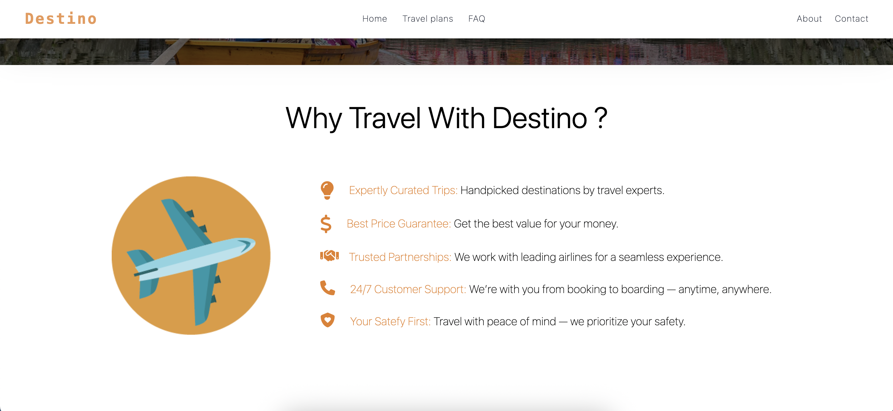
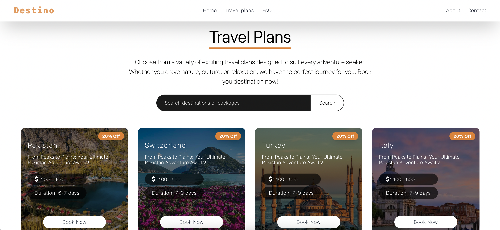
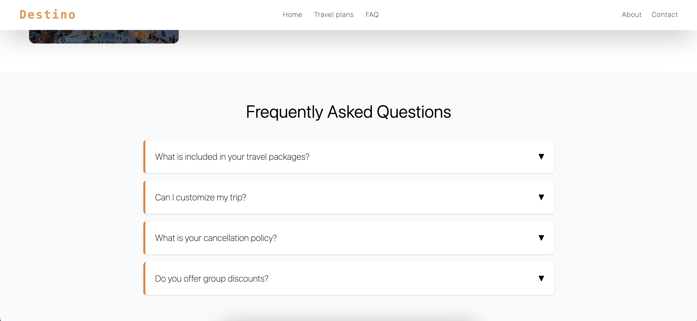
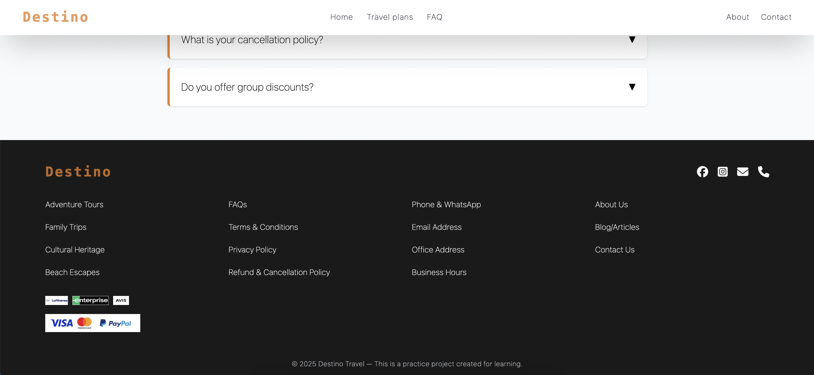

# 🌍 Destino — Travel Landing Page

**Destino** is a responsive travel-themed landing page built with **Tailwind CSS** and hosted on **GitHub Pages**.  
It features a modern hero section, travel package showcases, smooth navigation, and an elegant FAQ section.

---

## 🚀 Live Demo

🔗 **[View Site](https://summbal122.github.io/Destino/)**

---

## 📋 Table of Contents
- [About](#about)
- [Features](#features)
- [Screenshots](#screenshots)

---

##  About
Destino is a single-page travel website designed to promote tourism destinations.  
It demonstrates responsive design principles, clean UI, and smooth user interaction — perfect for learning Tailwind CSS or creating a travel-related promotional site.

---

##  Features
- Fully responsive layout
- Travel plans section with hover effects
- FAQ accordion section
- Footer with navigation & social icons

---

## Screenshots

**Main Section**

___

**Why Travel With Us**

___ 

**Travel Plans**

___

**FAQ**

___

**Footer**

___